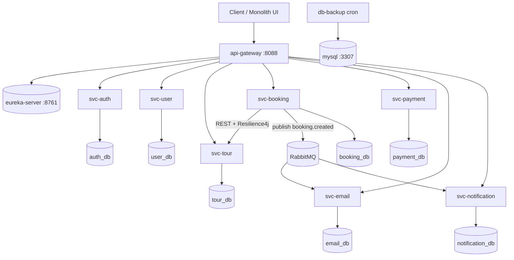

# Kiến trúc BookingTour Microservices

## Sơ đồ tổng quan

## 9 service lõi (theo yêu cầu đồ án)

| # | Service | Port nội bộ | Trách nhiệm |
|---|---------|-------------|-------------|
| 1 | api-gateway | 8080 (map 8088) | Routing `lb://`, JWT, Circuit Breaker |
| 2 | eureka-server | 8761 | Service discovery |
| 3 | svc-auth | 8080 | Đăng ký/đăng nhập, phát JWT |
| 4 | svc-user | 8080 | Hồ sơ user |
| 5 | svc-tour | 8080 | Catalog tour, **optimistic lock** chỗ |
| 6 | svc-booking | 8080 | Đặt chỗ, publish RabbitMQ |
| 7 | svc-payment | 8080 | VNPay |
| 8 | svc-email | 8080 | Consumer email, @Async, Quartz |
| 9 | svc-notification | 8080 | Consumer thông báo in-app |

**Phụ trợ user (không admin/chat):** svc-contact, svc-review, svc-favorite, svc-flight, svc-news.

## RabbitMQ

- **Exchange:** `booking.topic` (Topic)
- **Routing keys:** `booking.created`, `payment.completed`
- **Queues:**
  - `email.booking.created` → svc-email
  - `notification.booking.created` → svc-notification

## Flow đặt tour

1. Client `POST /api/bookings/reservations` + Bearer JWT → Gateway xác thực.
2. svc-booking gọi REST `svc-tour` giữ chỗ (`@Version` trên `quan_ly_cho`).
3. Lưu `dat_cho` kèm `booking_uuid` (UUID).
4. Publish `BookingCreatedMessage` → RabbitMQ.
5. svc-email: outbox + gửi mail async (thread pool).
6. svc-notification: ghi `user_notification`.

## Đồng bộ & chống race

- **Optimistic locking:** `QuanLyCho.version` — `ObjectOptimisticLockingFailureException` → HTTP 409 business error.
- **Messaging:** trạng thái email/notification eventual consistency qua RabbitMQ.

## JWT

- HS256, secret dùng chung (`JWT_SECRET`).
- Gateway `JwtGatewayFilter` decode Bearer trước khi forward.
- Resource server trên svc-booking, svc-auth, ...

## Backup & restore

- Container `db-backup` chạy `docker/backup/backup-databases.sh` mỗi 24h.
- Volume `mysql_backup` lưu file `.sql.gz`.
- **Restore:** `gunzip -c backup.sql.gz | mysql -h localhost -P 3307 -uroot -proot`
